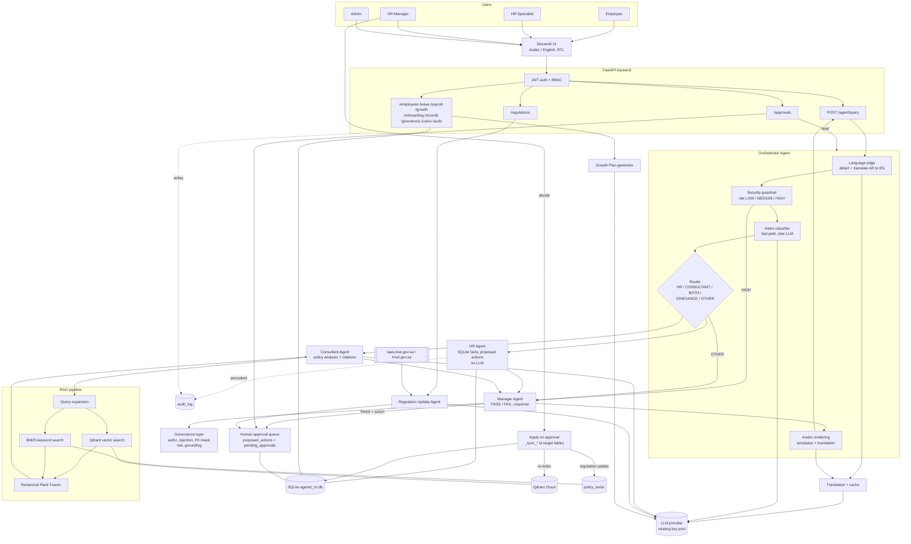

# Yusor — System Architecture

A description of the current system (September 2026). Section 1 is a
one-page overview (it also works as a prompt for a diagramming tool);
sections 2–6 list every component and connection; section 7 is a Mermaid
diagram.

---

## 1. Prompt for a diagram tool

> Draw a layered system architecture diagram for **Yusor**, a bilingual
> (Arabic/English) HR multi-agent assistant. Flow goes top to bottom:
>
> **Users** (4 roles: Employee, HR Specialist, HR Manager, Admin) →
> **Streamlit UI** (bilingual, RTL for Arabic) → **FastAPI backend** (JWT auth
> + role-based access) → **Orchestrator Agent**.
>
> Inside the Orchestrator, in order: **Language edge** (detect Arabic →
> translate to English) → **Security guardrail** (prompt-injection risk:
> HIGH blocks immediately) → **Intent classifier** (keyword fast path, else
> LLM) → **Router** with five branches: HR, CONSULTANT, BOTH (HR and
> Consultant in parallel), GRIEVANCE, OTHER.
>
> Three specialist agents:
> - **HR Agent** — deterministic, no LLM. Reads SQLite (leave, payroll,
>   attendance, profile, skills gap) and turns write requests into a
>   *proposed action* (leave, personal info, bank/IBAN, certificate, new hire,
>   termination).
> - **Consultant Agent** — policy analyst. Calls the **RAG pipeline**:
>   query expansion → hybrid retrieval (Qdrant vector search + in-memory BM25
>   keyword search, merged with Reciprocal Rank Fusion) → relevance
>   reranking → LLM answer with [Source: ID] citations.
> - **Manager Agent** — rule-based supervisor, no LLM. Uses the
>   **Governance layer** (authorization, prompt-injection check, PII masking,
>   risk classification, grounding/citation validation) and returns
>   **PASS or FAIL** plus the final response. Risky actions go to the
>   **Human approval queue**.
>
> After the Manager, the Orchestrator translates the answer back to Arabic if
> needed and returns `{status, response, sources}` to the UI.
>
> Side systems: **Human-in-the-loop approvals** (four-eyes: HR Manager/Admin
> approve, then the change is written to the target table), a **Regulation
> Update Agent** (daily watch of the official Saudi Labor Law site
> laws.boe.gov.sa and hrsd.gov.sa → detect changed articles → LLM impact
> analysis → approval → update law/policy text → re-index Qdrant), a
> **Growth Plan generator** (CV PDF + skill gap → LLM development plan), and
> a **Translation cache**.
>
> Data layer: **SQLite** (`agentic_hr.db`, employees, leave, payroll,
> approvals, audit log, regulations history…), **Qdrant Cloud** (policy +
> labor-law embeddings, all-MiniLM-L6-v2), **policy_texts/** files (176
> documents: 81 Saudi labor-law articles, 27 company policies, 68 Wage
> Protection System / Mudad documents), and an
> **LLM provider** (OpenAI-compatible API, e.g. Groq gpt-oss-120b) accessed
> through a **rotating multi-key client**.
>
> A cross-cutting **Audit log** (written by the API on login, record edits,
> approval decisions, onboarding and regulation edits) sits beside the pipeline.
> Use colors per layer: UI, API, agents, governance, data, external.

---

## 2. Layers and nodes

### 2.1 Users
| Node | Pages they see |
|---|---|
| Employee | Dashboard, Ask Yusor, Growth Opportunities, My Requests |
| HR Specialist | + Approvals (grievances only), Onboarding & Offboarding, Grievances, Records |
| HR Manager | + Approvals, Team Insights, Payroll, Regulations |
| Admin | + Users, Audit log |

### 2.2 Presentation — Streamlit UI (`app/ui/`)
- `streamlit_app.py` (login, role-based navigation), `views.py` (pages),
  `regulations_view.py`, `exports.py` (Excel/PDF), `i18n.py` (Arabic/English
  strings, RTL), `api_client.py` (HTTP to FastAPI; sends `Accept-Language`).

### 2.3 API — FastAPI (`app/api/`)
- Auth: JWT access + refresh tokens (`app/security/tokens.py`), passwords in
  `app/security/passwords.py`, role checks in `app/api/deps.py`.
- Error messages are localized to Arabic from `Accept-Language`.
- Routers:

| Router | Endpoints | Talks to |
|---|---|---|
| `/auth` | login, refresh, logout, me, verify-password | users table |
| `/agent` | `POST /agent/query` | **Orchestrator Agent** |
| `/approvals` | list, `/{id}/decide`, `/{id}/brief` | approvals DB, Orchestrator (Decision Brief) |
| `/employees`, `/leave`, `/payroll` | profile, balances, requests, payroll PDF | SQLite |
| `/proposed-actions` | list / get | SQLite |
| `/grievances` | list, get, decide | SQLite |
| `/experience-gap` | departments, `/{department_id}` | HR Agent helper |
| `/growth` | opportunities, `POST /opportunities/{skill_id}/cv` | Growth Plan generator |
| `/onboarding` | `parse-cv`, attach CV to proposal | CV parser; daily separation job |
| `/records` | archive list, facets, export, get | read-only SQLite |
| `/regulations` | status, check, articles, history, alerts, pending, edit proposed text, decide, reindex | Regulation Update Agent |
| `/users`, `/audit` | admin user management, audit log | SQLite |
| `/health` | status + LLM key-pool status | — |

### 2.4 Agent layer (`app/agents/`)

**Orchestrator Agent** (`orchestrator.py`) — `run({query, user}) → {status, response, sources}`
1. **Language edge**: `detect_language`; if Arabic, screen the raw Arabic text
   for injection, then `translate_to_english`. Everything downstream is English.
2. **Security guardrail** `assess_query_risk` → LOW / MEDIUM / HIGH.
   HIGH → `handle_high_risk` → Manager (`SECURITY_BLOCK`) → FAIL, stop.
3. **Intent** `classify_intent` → HR | CONSULTANT | BOTH | GRIEVANCE | OTHER
   (keyword fast path first, LLM classifier with one retry otherwise).
4. **Routing** (skips agents the intent doesn't need):
   - HR → HR Agent only
   - CONSULTANT → Consultant Agent only
   - BOTH → HR + Consultant **in parallel** (thread pool)
   - GRIEVANCE → ask for identity choice (hide/show) → Consultant (+ HR if
     identity shown) → Manager → save to `grievances` → status `PENDING_HR_REVIEW`
   - OTHER → straight to Manager
5. **Manager Agent** → PASS / FAIL + response.
6. **Arabic rendering**: Manager returns response *blocks* as (English, Arabic)
   pairs; fixed Arabic templates (`arabic_text.py`) are used where available
   and only the remaining paragraphs are LLM-translated, in parallel.
- Also: `explain_pending_approval(proposal_id)` → HR (context + historical
  precedent + termination profile) → Consultant (`{action_type}` policy
  citation) → Manager (compose Decision Brief). Used by `GET /approvals/{id}/brief`.

**HR Agent** (`hr_agent.py`) — `run({query, user, employee_id}) → {facts, proposed_action, sources}`
- No LLM, no RAG. Keyword/regex intent detection + SQLite reads.
- Read facts: leave balance & requests, payroll (by month), attendance,
  profile, department experience gap (manager/admin), historical precedent.
- Write intents → `proposed_action` (nothing written yet):
  `leave_request`, `personal_info_update`, `bank_update`,
  `certificate_request`, `new_hire`, `termination`.
- Enforces "employees act only on their own record".
- Helpers: `cv_parser.py` (onboarding CV → form fields), `leave_intent.py`,
  `payroll_report.py`.

**Consultant Agent** (`consultant_agent.py`) — `run({query}) or ({action_type}) → {recommendation, conflicts, sources}`
- Staged pipeline with a trace: INPUT_VALIDATION → INPUT_SECURITY →
  RETRIEVAL (top 8) → RERANKING (relevance score, keep best 3) →
  EVIDENCE_SECURITY (drop injected chunks) → POLICY_ANALYSIS (conflict
  detection) → GENERATION (LLM, cites `[Source: ID]`) → OUTPUT_VALIDATION.
- Independent of HR (never reads `hr_result`).
- Writes the answer directly in Arabic for Arabic readers (except grievances).

**Manager Agent** (`manager_agent.py`) — `run({query, user, hr_result, consultant_result}) → {decision, reasons, response}`
- Rule-based, no LLM for the verdict. Checks: prompt injection / MEDIUM risk,
  authorization, consultant conflicts, requested days ≤ remaining balance,
  missing payload fields, grounding (`validate_output`) for policy answers.
- Composes the response: HR facts + action summary + policy answer, or a
  Decision Brief. Masks PII (except the user's own just-submitted value).
- On PASS with a proposed action → `_submit_for_approval` → `proposed_actions`
  + `pending_approvals` (duplicate pending requests are detected).

**Regulation Update Agent** (`regulation_agent.py`) — runs outside the chat flow
- Daily (and on demand via `POST /regulations/check`): fetch Saudi Labor Law
  from laws.boe.gov.sa (polite 10 s crawl delay, pinned DigiCert
  intermediate) and news from hrsd.gov.sa.
- Detect new / changed / removed articles by text hash → LLM impact analysis
  against affected `saudi_labor_law` / `company_policies` rows (uses RAG) →
  `regulation_update` proposed action (HIGH risk, requester = "system").
- After HR Manager/Admin approval (the person who edited the text cannot
  approve): old + new text saved in `regulation_versions`, DB row and
  `policy_texts/` file updated, Qdrant re-indexed.
- Simulate mode (`REGULATION_SOURCE=simulated`) only runs on a demo DB copy,
  demo Qdrant collection and demo policy folder.

**Growth Plan generator** (`growth_plan.py`) — CV PDF (text extracted,
PII masked, injection-filtered) + missing department skill → LLM → saved to
`candidate_growth_plans`.

**Translation** (`translation.py`, `arabic_text.py`) — Arabic↔English via
LLM with a glossary; protects IDs, numbers, emails, IBANs and `[Source]` tags;
results cached in memory and in the `translation_cache` table; stored free
text (grievances, briefs, plans) is translated for the reader and prefetched
in the background.

### 2.5 Governance & security (`app/security/governance.py`) — cross-cutting
- `check_authorization` (role + own-record rules), `detect_prompt_injection`,
  `sanitize_input`, `mask_pii`, `classify_risk` (low / medium / high),
  `requires_human_approval`, `validate_output` (lexical grounding, with an
  Arabic-aware path), `verify_citations`, `check_rate_limit`.

### 2.6 RAG infrastructure (`app/rag/`)
- `ingest.py`: `policy_texts/**` → one chunk per file → embeddings → Qdrant
  collection `yusor_policies`.
- `embeddings.py`: sentence-transformers `all-MiniLM-L6-v2` (loaded once at
  API start).
- `query_expansion.py`: adds policy wording to everyday phrasing
  ("carry forward" → "postpone … following year"; sick-leave procedure terms).
- `retrieve.py`: expanded query → Qdrant dense search + `keyword.py` BM25 →
  Reciprocal Rank Fusion (k = 60).
- `generate.py`: `answer_with_rag` (LLM answer from retrieved chunks).

### 2.7 LLM access (`app/llm.py`)
- One OpenAI-compatible client for every LLM call (intent, Consultant,
  translation, growth plans, regulation analysis).
- `LLM_API_KEYS` pool: round-robin across keys, a key that hits 429 rests for
  the time the provider says, next key serves the request. Short calls use
  small token caps and low reasoning effort (`fast_llm_options`).

### 2.8 Data stores
| Store | Contents |
|---|---|
| **SQLite `agentic_hr.db`** | `employees` (500), `departments` (12), `users` / `roles`, `leave_balances`, `leave_requests`, `payroll_monthly`, `attendance_leave_monthly`, `proposed_actions`, `pending_approvals`, `personal_info_update_requests`, `sensitive_change_requests`, `grievances`, `audit_log`, `saudi_labor_law` (70), `company_policies` (27), `skills`, `department_requirements`, `skill_job_titles`, `regulation_versions`, `employee_cvs`, `candidate_growth_plans`, `translation_cache`, `tasks` |
| **Qdrant Cloud** | vector index of the 176 policy / law / WPS texts |
| **`policy_texts/`** | source text files: `saudi_labor_law/` (81), `company_policies/` (27), `WPS/` (68) |
| **LLM provider** | OpenAI-compatible chat API (Groq `openai/gpt-oss-120b` in the team setup) |
| **External sites** | laws.boe.gov.sa, hrsd.gov.sa (Regulation Update Agent only) |

---

## 3. Main edges (for arrows)

**Chat request (`POST /agent/query`)**
1. User → Streamlit UI → FastAPI `/agent/query` (JWT verified, input sanitized)
2. FastAPI → Orchestrator
3. Orchestrator → Translation (Arabic only) → LLM
4. Orchestrator → Security guardrail → (HIGH) Manager → FAIL response
5. Orchestrator → Intent classifier → LLM (if no fast-path match)
6. Orchestrator → HR Agent → SQLite
7. Orchestrator → Consultant Agent → RAG (Query expansion → Qdrant + BM25 → RRF) → LLM
8. HR result + Consultant result → Manager Agent → Governance checks
9. Manager → (proposed action, PASS) → `proposed_actions` + `pending_approvals`
10. Manager → Orchestrator → (Arabic) Translation → FastAPI → UI

**Human approval**
1. HR Manager/Admin → UI Approvals → `GET /approvals/{id}/brief` → Orchestrator
   `explain_pending_approval` → HR + Consultant + Manager → Decision Brief
2. `POST /approvals/{id}/decide` → `app/db/approvals.py` `_sync_*` → target
   table (leave_requests, personal info, bank, employees for new hire /
   termination, law/policy text for regulation updates); the router writes audit_log

**Scheduled jobs (on API start + daily)**
- `finalize_due_separations`: terminations past their last working day →
  final employment status, account deactivated.
- Regulation check: BOE / HRSD → Regulation Update Agent → proposed
  `regulation_update` → approval → `regulation_versions` + DB + files → Qdrant re-index.

---

## 4. Response statuses
`PASS`, `FAIL`, `IDENTITY_REQUIRED` (grievance needs hide/show choice),
`PENDING_HR_REVIEW` (grievance saved). The frozen contract also lists `REPLAN`.

## 5. Risk & approval rules
- Query risk (Orchestrator): HIGH → blocked before any agent; MEDIUM → Manager FAIL.
- Action risk (`classify_risk`): high = bank/IBAN, salary, termination,
  employment status, disciplinary; medium = leave; low = personal info.
- New hire, termination and regulation updates are always HIGH and need
  approval; no DB write happens before approval.

## 6. Evaluation (outside the runtime)
`eval/run_eval.py` (golden cases per agent, fresh DB copy), `eval/run_ragas.py`
(Ragas faithfulness / context precision / recall / answer relevancy),
`eval/run_llm_judge.py` (LLM-as-a-Judge), and offline unit tests `eval/test_*.py`.

---

## 7. Mermaid

