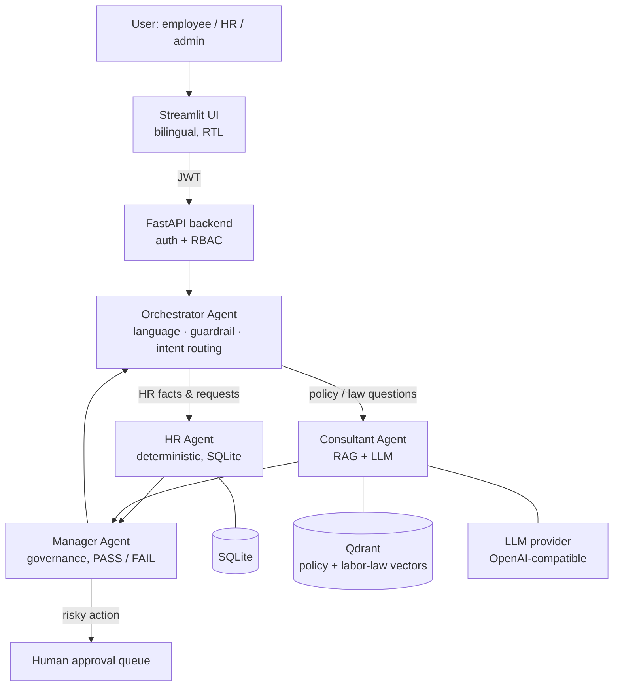

# Yusor — HR Multi-Agent Assistant

**Yusor** (يُسر) is a bilingual (Arabic / English), policy-grounded HR assistant built as a multi-agent system. Employees ask questions and submit requests in plain language. Specialist agents answer from the HR database and from Saudi Labor Law and company policy documents. A supervisor agent checks every answer before the user sees it, and risky actions wait for human approval.

> All employee data in this repository is **synthetic**. The project is a demo and portfolio piece, not a production HR system (see [Security notes](#security-notes)).

## Highlights

- **Four cooperating agents** with frozen input/output contracts: an Orchestrator routes each request to the HR Agent, the Consultant Agent, or both, and the Manager Agent validates the result (PASS / FAIL).
- **Hybrid RAG with citations**: query expansion → Qdrant vector search + BM25 keyword search → Reciprocal Rank Fusion. Answers cite their sources as `[Source: ID]`, and the Manager Agent rejects claims it can't ground.
- **Human in the loop**: leave, bank/IBAN changes, new hires and terminations become *proposed actions*. Nothing is written until an HR manager approves it, with help from an AI **Decision Brief**.
- **Governance layer**: role-based access, prompt-injection detection, PII masking, risk classification and an audit log.
- **Fully bilingual**: Arabic questions are answered in Arabic and the UI switches to right-to-left.
- **Evaluation harness**: golden test cases per agent, 150 offline unit tests, LLM-as-judge and Ragas RAG metrics.

## Features

- **Ask Yusor** chat in Arabic or English: leave balance, payroll, attendance, profile, and policy / labor-law questions with `[Source: ID]` citations.
- **Self-service requests** through chat: leave, personal-info update, bank/IBAN change, certificate. Each one becomes a proposed action for approval.
- **Approvals** with an AI **Decision Brief** (employee context, historical precedent, policy citation, termination profile).
- **Grievances** (anonymous or named), reviewed by HR.
- **Onboarding & Offboarding**: new hire (with CV auto-fill) and termination (notice period, final settlement per Labor Law Art. 74–88).
- **Regulation Update Agent**: watches laws.boe.gov.sa / hrsd.gov.sa, proposes text updates, needs four-eyes approval, then re-indexes the RAG store.
- **Team Insights** (experience gap per department) and **Growth Opportunities** (CV-based growth plans).
- **Records** archive, **Payroll** PDFs, Excel/PDF exports, plus **Users** and **Audit log** pages for admins.

## Architecture



The full component list, data flow and role permissions are in **[ARCHITECTURE.md](ARCHITECTURE.md)**.

## Tech stack

| Layer | Technology |
|---|---|
| Frontend | Streamlit (custom theme, Arabic RTL) |
| Backend | FastAPI, Pydantic, PyJWT |
| Agents | Plain Python classes with a shared `run(input) -> dict` contract |
| Retrieval | Qdrant, sentence-transformers (`all-MiniLM-L6-v2`), in-memory BM25, RRF |
| LLM | Any OpenAI-compatible API (developed on Groq `openai/gpt-oss-120b`), with multi-key rotation and 429 failover |
| Data | SQLite (synthetic HR data), 176 policy / labor-law / WPS documents in `policy_texts/` |
| Documents | fpdf2 + uharfbuzz (Arabic PDFs), openpyxl, pypdf |

## Project structure

```text
app/
  agents/       Orchestrator, HR, Consultant, Manager, Regulation agents and helpers
  api/          FastAPI app and routers (auth, agent, approvals, leave, payroll, ...)
  db/           SQLite data-access helpers, one module per domain
  rag/          ingest, embeddings, hybrid retrieval, answer generation
  security/     JWT tokens, password hashing, governance checks
  ui/           Streamlit app, pages, styles, i18n (Arabic / English)
policy_texts/   Source documents indexed for RAG
eval/           Golden cases, eval runners, unit tests, saved results
docs/           Team workflow and the project report
agentic_hr.db   Synthetic demo database
```

## Getting started

### Prerequisites

- Python 3.10+
- A [Qdrant](https://qdrant.tech/) cluster (Qdrant Cloud free tier works)
- An API key for an OpenAI-compatible LLM provider (for example Groq or OpenAI)

### Install

```bash
git clone https://github.com/ShahadBusaleh/YusrAgent.git
cd YusrAgent
python -m venv .venv
# Windows: .venv\Scripts\activate    macOS/Linux: source .venv/bin/activate
pip install -r requirements.txt
cp .env.example .env        # Windows PowerShell: copy .env.example .env
```

### Configure

Fill in `.env` (it is git-ignored, so never commit it): `JWT_SECRET`, `QDRANT_URL`, `QDRANT_API_KEY` and `LLM_API_KEY`. Make sure `LLM_BASE_URL` and `LLM_MODEL` belong to the same provider (both Groq or both OpenAI). A mismatch causes 404 errors from the agent pipeline.

Optional settings:

| Variable | Default | What it does |
|---|---|---|
| `LLM_API_KEYS` | — | Several keys, comma-separated. Overrides `LLM_API_KEY`. `app/llm.py` rotates them and moves on when one hits a rate limit. Only adds capacity if each key is from a different organization. |
| `LLM_FAST_REASONING_EFFORT` | `low` | Reasoning effort for short calls (intent, translation). `""` turns it off. |
| `REGULATION_AUTO_CHECK` | `1` | `0` turns off the daily Labor Law check (laws.boe.gov.sa). |
| `REGULATION_SOURCE` | real sites | `simulated` = demo data. Only runs with a demo `SQLITE_PATH`, a demo `QDRANT_COLLECTION` and a `REGULATION_DEMO_POLICY_DIR` outside `policy_texts/`. |
| `YUSOR_PREFETCH_TRANSLATIONS` | `1` | `0` stops background Arabic translation of stored text (the eval harness does this). |

### Index the policy documents (once)

```bash
python -m app.rag.ingest
```

Run this once per Qdrant collection, and again after files under `policy_texts/` change. To check retrieval and generation from the command line:

```bash
python -m app.rag.retrieve "What is the minimum annual leave per year?"   # expected top hit: LAW037
python -m app.rag.generate "What is the minimum annual leave per year?"
```

## Running the app

Yusor runs as two processes. Start each one in its own terminal from the project root and leave both open.

**Terminal 1 — backend (FastAPI, port 8000):**
```bash
uvicorn app.api.main:app --reload
```
Wait for `Application startup complete.`

**Terminal 2 — frontend (Streamlit, port 8501):**
```bash
streamlit run app/ui/streamlit_app.py
```
Streamlit opens `http://localhost:8501` in your browser. It reaches the backend through `API_BASE_URL` in `.env`, and chat requests go to `POST /agent/query` → `OrchestratorAgent.run`.

**Check that the backend is up:**
```bash
curl http://127.0.0.1:8000/health      # {"status":"ok","llm_keys":{...}}
```
`llm_keys` shows how many LLM keys are configured and how many are resting after a rate limit. It never shows the key values.

### Demo accounts

Every seeded account uses the password `ChangeMe123!`:

| Role | Username | Persona |
|---|---|---|
| Employee | `EMP-0002` | Rana Al Harbi |
| HR manager | `EMP-0001` | Mona Saleh |
| Admin | `EMP-0048` | Sara Al Ghamdi |

The language button (on the login page and in the sidebar) switches the UI to Arabic. You can also just ask Yusor in Arabic. For a guided 8-minute tour, see **[DEMO_SCENARIO.md](DEMO_SCENARIO.md)**.

### Stopping

Press **Ctrl+C** in each terminal. If the terminals are gone, free the ports instead (Windows PowerShell):

```powershell
Get-NetTCPConnection -LocalPort 8000,8501 -State Listen -ErrorAction SilentlyContinue |
    ForEach-Object { Stop-Process -Id $_.OwningProcess -Force }
```

On macOS/Linux: `kill $(lsof -t -i:8000 -i:8501)`.

## Testing and evaluation

```bash
python -m unittest discover -s eval -p "test_*.py"   # 150 offline unit tests, model calls mocked
python -m eval.run_eval --offline                     # HR + Manager golden cases, no API calls
python -m eval.run_eval                               # full pipeline (needs LLM + Qdrant)
```

LLM-as-judge and Ragas scoring (faithfulness, context precision/recall, answer relevancy) are described in **[eval/README.md](eval/README.md)**. Saved results are in `eval/results/` and `eval/golden/`.

## Troubleshooting

- **UI loads but every query fails with LLM errors**: check that `LLM_BASE_URL` and `LLM_MODEL` in `.env` belong to the same provider. `.env.example` shows the Groq pairing.
- **429 / quota errors**: the provider's rate limit or daily quota is used up. Wait for the reset, or add keys from other organizations to `LLM_API_KEYS`. This is not a code issue.
- **First request is slow**: the embedding model loads at API start, and the Qdrant and LLM connections warm up on first use. Later requests are faster.
- **Port already in use**: an earlier run is still bound to 8000 or 8501 (see [Stopping](#stopping)), or another app is using the port.

## Security notes

This is a demo with synthetic data, so a few things are deliberately simple:

- Seeded accounts share one documented password, and `app/security/passwords.py` uses unsalted SHA-256 hashing (isolated in one module so bcrypt/argon2 can replace it). Replace both before any real use.
- CORS currently allows all origins.
- Secrets (JWT secret, Qdrant and LLM keys) are read from environment variables only. See `.env.example`.

## Documentation

| Document | Contents |
|---|---|
| [ARCHITECTURE.md](ARCHITECTURE.md) | Components, data flow, diagrams |
| [DATABASE_SCHEMA.md](DATABASE_SCHEMA.md) | Tables, columns, seeded data |
| [DEMO_SCENARIO.md](DEMO_SCENARIO.md) | Step-by-step demo script |
| [eval/README.md](eval/README.md) | Evaluation harness and metrics |
| [docs/TEAM.md](docs/TEAM.md) | Team workflow, ownership and frozen agent contracts |
| [docs/HR_Multi-Agent_Assistant_Report.md](docs/HR_Multi-Agent_Assistant_Report.md) | Project report |

## Development conventions

- Don't change the columns of existing tables. Add new tables only (see `DATABASE_SCHEMA.md`).
- RAG is shared infrastructure used by the Consultant Agent, not a separate agent.
- Don't rename the frozen agent contract keys in [docs/TEAM.md](docs/TEAM.md).

## Team

Built by a four-person team:
[@ShahadBusaleh](https://github.com/ShahadBusaleh) ·
[@aeshahs22-ops](https://github.com/aeshahs22-ops) ·
[@Amal Albaraiki](https://github.com/AmalAlbaraiki) . 
[@ghaidaaljahmi-ux](https://github.com/ghaidaaljahmi-ux)
